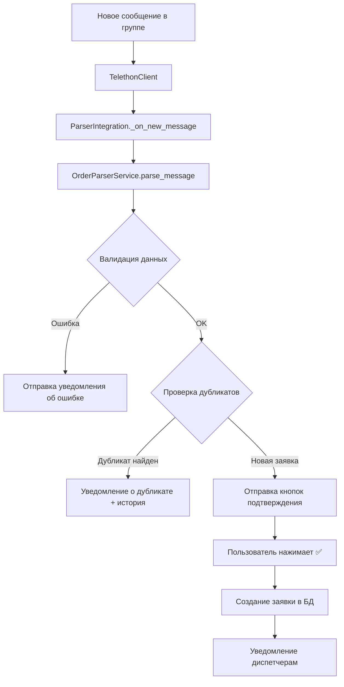

# Парсер заявок из Telegram-группы

## Обзор

Автоматический парсер заявок извлекает информацию о ремонтных работах из неструктурированных текстовых сообщений в Telegram-группе и создаёт заявки в системе.

## Возможности

### ✅ Автоматическое извлечение данных

Парсер распознаёт и извлекает следующие поля из текстовых сообщений:

- **Тип оборудования**: Холодильник, Стиральная машина, Электрика, Сантехника и т.д.
- **Описание проблемы**: Текстовое описание неисправности
- **Адрес**: Улица, дом, квартира
- **Телефон**: Номер телефона клиента (различные форматы)
- **Время прибытия**: Автоматическое определение времени из естественного языка
- **Имя клиента**: Извлечение из сообщения или использование значения по умолчанию

### ✅ Интеллектуальный парсинг времени

Парсер понимает различные форматы времени на естественном языке:

- **Относительное время**: "через 1 час", "через 1-1.5 часа", "через полтора часа"
- **Абсолютное время**: "завтра в 10:00", "сегодня в 16:00", "послезавтра"
- **Интервалы**: "с 10 до 12", "до 16:00", "после 15"
- **Конкретные даты**: "01.11.2025 14:00", "завтра в 10"

Примеры обработки:
```
"Через 1-1.5 часа" → "29.11.2025 14:27 (через 1.25 часа)"
"завтра в 10" → "30.11.2025 10:00 (завтра в 10:00)"
"после 15" → "29.11.2025 16:00"
"16:00" → "29.11.2025 16:00 (сегодня в 16:00)"
```

### ✅ Валидация данных

Парсер проверяет корректность извлечённых данных:

1. **Проверка телефона**:
   - Номер должен содержать 11 цифр
   - Поддержка форматов: `89001234567`, `+79001234567`, `8 (900) 123-45-67`
   - Уведомление об ошибке при неполном номере

2. **Проверка описания проблемы**:
   - Описание не должно быть пустым
   - Описание не должно совпадать с типом оборудования
   - Уведомление с примерами корректного заполнения

3. **Проверка на дубликаты**:
   - Поиск активных заявок по адресу, телефону и типу оборудования
   - Предупреждение о существующих заявках перед созданием

### ✅ История клиента

При создании заявки автоматически отображается история обращений клиента:

- Общее количество заявок
- Количество завершённых и отказанных заявок
- Общая выручка от клиента
- Последние 5 заявок с деталями:
  - Номер заявки, дата, тип оборудования
  - Статус и сумма
  - Причина отказа (если была)

### ✅ Поддержка различных форматов сообщений

#### Формат 1: Построчный
```
Электрика не работает розетка
Гагарина 15 кв 39
Через 1 час
89053489555
```

#### Формат 2: Однострочный
```
Холодильник не морозит, Ленина 20-45, 89001234567, завтра в 10
```

#### Формат 3: С именем клиента
```
Иван Петров
Стиральная машина не крутит барабан
Пушкина 10 кв 5
+79001234567
Сегодня после 15
```

## Настройка

### 1. Конфигурация парсера

Парсер настраивается через таблицу `parser_config` в базе данных:

```sql
INSERT INTO parser_config (group_id, enabled)
VALUES (-5023235262, 1);
```

**Параметры**:
- `group_id`: ID Telegram-группы для мониторинга (отрицательное число)
- `enabled`: 1 - парсер активен, 0 - парсер отключён

### 2. Переменные окружения

Убедитесь, что в `.env` указаны:

```env
# Telegram API (для Telethon)
TELEGRAM_API_ID=your_api_id
TELEGRAM_API_HASH=your_api_hash
TELEGRAM_PHONE=+79001234567

# ID группы диспетчеров для уведомлений
DISPATCHER_GROUP_ID=-1001234567890
```

### 3. Авторизация Telethon

При первом запуске Telethon запросит код подтверждения:

```bash
python bot.py
# Введите код из SMS или Telegram
```

Сессия сохраняется в файл `parser_session.session` и повторная авторизация не требуется.

## Архитектура

### Основные компоненты

```
app/services/
├── parser_integration.py          # Интеграция парсера с ботом
└── telegram_parser/
    ├── parser_service.py          # Основная логика парсинга
    ├── telethon_client.py         # Клиент для мониторинга группы
    ├── patterns.py                # Regex-паттерны для извлечения данных
    ├── equipment_dict.py          # Словарь сокращений оборудования
    └── schemas.py                 # Pydantic-схемы для валидации
```

### Поток обработки сообщения



### Методы парсинга

**OrderParserService** использует эвристический подход:

1. **Удаление телефона из строк** (`_remove_phone_from_lines`):
   - Извлечение телефона через regex
   - Удаление строки с телефоном из дальнейшей обработки

2. **Извлечение времени** (`_extract_time_from_lines`):
   - Поиск временных индикаторов ("через", "завтра", "в 10:00")
   - Парсинг через `parse_natural_datetime`
   - Форматирование для сохранения в БД

3. **Разделение оборудования и адреса** (`_split_equipment_and_address`):
   - Строки с адресными словами → адрес
   - Остальные строки → оборудование и проблема

4. **Извлечение описания проблемы** (`_extract_problem_description`):
   - Удаление типа оборудования из текста
   - Очистка от лишних символов
   - Валидация минимальной длины

## Обработка ошибок

### Некорректный номер телефона

**Сообщение в группе**:
```
⚠️ Некорректный номер телефона: 895348955

Номер должен содержать 11 цифр в формате:
• 89001234567
• +79001234567
• 8 (900) 123-45-67
```

### Отсутствует описание проблемы

**Сообщение в группе**:
```
⚠️ Не указано описание проблемы

Пожалуйста, добавьте описание проблемы после типа оборудования.
Например:
• Электрика не работает розетка
• Стиральная машина не крутит барабан
• Холодильник не морозит
```

### Обнаружен дубликат

**Сообщение с кнопками подтверждения**:
```
⚠️ ВНИМАНИЕ! Найдена активная заявка с такими же данными:

📋 Заявка #18
📍 Адрес: Гагарина 15 кв 39
🔧 Тип: Электрика
📊 Статус: 🆕 Новая
📅 Создана: 29.11.2025 03:10

📊 История клиента по адресу Гагарина 15 кв 39:
Всего заявок: 3
✅ Завершено: 1
❌ Отказано: 1
💰 Общая сумма: 5000.00 ₽

📋 Последние заявки:
#20 - Холодильник (29.11.2025) - ✅ Завершена - 6000.00 ₽
#19 - Электрика (29.11.2025) - ❌ Отказ - Не указана
#18 - Электрика (29.11.2025) - 🆕 Новая

Создать новую заявку?
[✅ Создать заявку] [❌ Отменить]
```

## Примеры использования

### Пример 1: Простая заявка

**Входное сообщение**:
```
Холодильник не морозит
Ленина 20 кв 45
89001234567
Завтра в 10
```

**Результат**:
```
✅ Заявка #22 создана из парсера!

🔧 Холодильник
📍 Ленина 20 кв 45
📞 89001234567
⏰ Время: 30.11.2025 10:00 (завтра в 10:00)
```

### Пример 2: Заявка с относительным временем

**Входное сообщение**:
```
Электрика не работает розетка
Гагарина 15 кв 39
Через 1-1.5 часа
89053489555
```

**Результат**:
```
✅ Заявка #23 создана из парсера!

🔧 Электрика
📍 Гагарина 15 кв 39
📞 89053489555
⏰ Время: 29.11.2025 14:27 (через 1.25 часа)
```

### Пример 3: Заявка с именем клиента

**Входное сообщение**:
```
Иван Петров
Стиральная машина не крутит барабан
Пушкина 10 кв 5
+79001234567
Сегодня после 15
```

**Результат**:
```
✅ Заявка #24 создана из парсера!

🔧 Стиральная машина
📍 Пушкина 10 кв 5
📞 +79001234567
⏰ Время: 29.11.2025 16:00
```

## Управление парсером

### Включение/отключение

Парсер можно включить или отключить через базу данных:

```sql
-- Отключить парсер
UPDATE parser_config SET enabled = 0 WHERE group_id = -5023235262;

-- Включить парсер
UPDATE parser_config SET enabled = 1 WHERE group_id = -5023235262;
```

После изменения требуется перезапуск бота.

### Изменение группы мониторинга

```sql
-- Изменить ID группы
UPDATE parser_config SET group_id = -1001234567890 WHERE id = 1;
```

### Логирование

Парсер пишет детальные логи в консоль:

```
2025-11-29 13:12:15 - app.services.telegram_parser.parser_service - DEBUG - Время распарсено: 'Через 1-1.5 часа' -> '29.11.2025 14:27 (через 1.25 часа)'
2025-11-29 13:12:15 - app.services.parser_integration - INFO - ✅ Заявка #23 успешно создана из сообщения 12345
```

## Troubleshooting

### Парсер не запускается

**Проблема**: Парсер не активируется при запуске бота

**Решение**:
1. Проверьте наличие записи в `parser_config`
2. Убедитесь что `enabled = 1`
3. Проверьте переменные окружения (`TELEGRAM_API_ID`, `TELEGRAM_API_HASH`)
4. Проверьте логи на наличие ошибок авторизации

### Парсер не создаёт заявки

**Проблема**: Сообщения в группе игнорируются

**Решение**:
1. Убедитесь что сообщения отправляются в правильную группу (`group_id`)
2. Проверьте что сообщения содержат все обязательные поля
3. Проверьте логи парсера на наличие ошибок валидации

### Неправильное извлечение данных

**Проблема**: Парсер неправильно определяет тип оборудования или адрес

**Решение**:
1. Проверьте формат сообщения (должен быть построчным или через запятую)
2. Добавьте сокращение в `equipment_dict.py` если нужно
3. Убедитесь что адрес содержит адресные слова (улица, дом, квартира и т.д.)

### Время не определяется

**Проблема**: Время прибытия отображается как текст вместо конкретной даты

**Решение**:
1. Проверьте что временной индикатор соответствует поддерживаемым форматам
2. Проверьте логи: должно быть сообщение "Время распарсено: ..."
3. Убедитесь что `parse_natural_datetime` и `format_datetime_for_storage` импортированы

## Расширение функциональности

### Добавление новых сокращений оборудования

Отредактируйте `app/services/telegram_parser/equipment_dict.py`:

```python
EQUIPMENT_ABBREVIATIONS: dict[str, str] = {
    # ... существующие ...
    "газовая": "Газовая плита",
    "вытяжка": "Вытяжка",
}
```

### Добавление новых паттернов времени

Отредактируйте `app/services/telegram_parser/patterns.py`:

```python
TIME_PATTERN: Pattern[str] = re.compile(
    r"""
    # ... существующие паттерны ...
    |
    # Новый паттерн
    \bпозже\b
    """,
    re.VERBOSE | re.IGNORECASE,
)
```

### Кастомизация уведомлений

Отредактируйте `app/services/parser_integration.py`:

```python
# Изменить формат уведомления (строка 380)
message_text = f"✅ <b>Заявка #{new_order.id} создана!</b>\n\n"
message_text += f"🔧 {order.equipment_type}\n"
# ... добавьте свои поля ...
```

## Связанные файлы

- **Основной код**: `app/services/telegram_parser/`
- **Интеграция**: `app/services/parser_integration.py`
- **Конфигурация**: Таблица `parser_config` в БД
- **Паттерны**: `app/utils/date_parser.py`
- **Тесты**: (планируются)

## История изменений

### v2.10.3 (29.11.2025)
- ✅ Добавлено автоматическое определение времени прибытия
- ✅ Добавлена валидация номера телефона с уведомлениями
- ✅ Добавлена валидация описания проблемы
- ✅ Добавлена проверка на дубликаты перед подтверждением
- ✅ Добавлена история клиента при обнаружении дубликатов
- ✅ Исправлено сохранение времени в базу данных
- ✅ Улучшена обработка телефонов с различными форматами
- ✅ Улучшена обработка времени ("через 1-1.5 часа" и т.д.)

### v2.10.0 (28.11.2025)
- 🎉 Первый релиз парсера заявок из Telegram-группы
- ✅ Базовый парсинг текстовых сообщений
- ✅ Интеграция с Telethon для мониторинга группы
- ✅ Система подтверждения заявок через inline-кнопки
